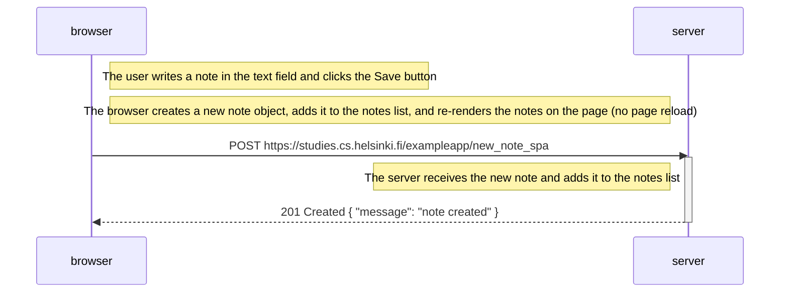

```mermaid
sequenceDiagram
    participant browser
    participant server

    Note right of browser: The user writes a note in the text field and clicks the Save button

    Note right of browser: The browser creates a new note object, adds it to the notes list, and re-renders the notes on the page (no page reload)

    browser->>server: POST https://studies.cs.helsinki.fi/exampleapp/new_note_spa
    activate server
    Note left of server: The server receives the new note and adds it to the notes list
    server-->>browser: 201 Created { "message": "note created" }
    deactivate server
```
